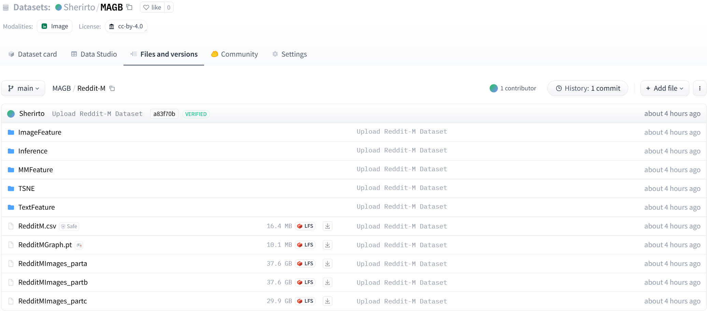

# MAGB[](https://doi.org/10.5281/zenodo.15551657)

<p>
    
</p>

<p>
    <b>MAGB: A Comprehensive Benchmark for Multimodal Attributed Graphs</b>
</p>

In many real-world scenarios, graph nodes are associated with multimodal attributes, such as texts and images, resulting in **Multimodal Attributed Graphs (MAGs)**.

MAGB first provide 5 dataset from E-Commerce and Social Networks. And we evaluate two major paradigms: _**GNN-as Predictor**_ and **_VLM-as-Predictor_** . The datasets are publicly available:

<p>
     🤗 <a href="https://huggingface.co/datasets/Sherirto/MAGB">Hugging Face</a>&nbsp&nbsp  | &nbsp&nbsp📑 <a href="https://arxiv.org/abs/2410.09132">Paper</a>&nbsp&nbsp
</p>

## 📖 Table of Contents

- [📖 Introduction](#-introduction)
- [💻 Installation](#-installation)
- [🚀 Usage](#-usage)

---

## 📖 Introduction

Multimodal attributed graphs (MAGs) incorporate multiple data types (e.g., text, images, numerical features) into graph structures, enabling more powerful learning and inference capabilities.  
This benchmark provides:  
✅ **Standardized datasets** with multimodal attributes.  
✅ **Feature extraction pipelines** for different modalities.  
✅ **Evaluation metrics** to compare different models.  
✅ **Baselines and benchmarks** to accelerate research.

---

## 💻 Installation

Ensure you have the required dependencies installed before running the benchmark.

```bash
# Clone the repository
git clone https://github.com/sktsherlock/MAGB.git
cd MAGB

# Install dependencies
pip install -r requirements.txt
```

# 🚀 Usage

## 1. Download the datasets from [MAGB](https://huggingface.co/datasets/Sherirto/MAGB). 👐

```bash
cd Data/
sudo apt-get update && sudo apt-get install git-lfs && git clone https://huggingface.co/datasets/Sherirto/MAGB .
ls
```

Now, you can see the **Movies**, **Toys**, **Grocery**, **Reddit-S** and **Reddit-M** under the **''Data''** folder.

<p align="center">
    
<p>

Each dataset consists of several parts shown in the image below, including:

- Graph Data (\*.pt): Stores the graph structure, including adjacency information and node labels. It can be loaded using DGL.
- Node Textual Metadata (\*.csv): Contains node textual descriptions, neighborhood relationships, and category labels.
- Text, Image, and Multimodal Features (TextFeature/, ImageFeature/, MMFeature/): Pre-extracted embeddings from the MAGB paper for different modalities.
- Raw Images (\*.tar.gz): A compressed folder containing images named by node IDs. It needs to be extracted before use.

Because of the Reddit-M dataset is too large, you may need to follow the below scripts to unzip the dataset.

```bash
cd MAGB/Data/
cat RedditMImages_parta RedditMImages_partb RedditMImages_partc > RedditMImages.tar.gz
tar -xvzf RedditMImages.tar.gz
```

## 2. Experiments

In this section, we demonstrate the execution code for both GNN-as-Predictor and VLM-as-Predictor.

### GNN-as-Predictor

#### 🧩 Node Classification

In the `GNN/Library` directory, we provide the code for models evaluated in the paper, including `GCN, GraphSAGE, GAT, RevGAT`,and `MLP`. Additionally, we have added graph learning models such as `APPNP`, `SGC`, `Node2Vec`, and `DeepWalk` for your use. Below, we show the code for node classification using `GCN` on the Movies dataset in two scenarios: 3-shot learning and supervised learning.

```python
python GNN/Library/GCN.py --graph_path Data/Movies/MoviesGraph.pt --feature Data/Movies/TextFeature/ Movies_roberta_base_512_mean.npy --fewshots 3
```

```python
python GNN/Library/GCN.py --graph_path Data/Movies/MoviesGraph.pt --feature Data/Movies/TextFeature/ Movies_roberta_base_512_mean.npy --train_ratio 0.6 --val_ratio 0.2
```

Note: The file `Movies_roberta_base_512_mean.npy` contains the textual features of the Movies dataset extracted using the RoBERTa-Base model. `512` indicates the maximum text length used, and `mean` indicates that mean pooling was applied to extract the features. You can use the features we provide or extract your own.

Similarly, you can replace GCN.py with the corresponding code for other models, such as `GraphSAGE.py`, `GAT.py`, etc. For all node classification training code, it is necessary to pass the graph data path and the corresponding feature file. Other basic parameters can be found in the `GNN/Utils/model_config.py` file.

Below are the key parameters related to model training, along with their default values and descriptions:

| Parameter           | Type    | Default Value | Description                                                 |
| ------------------- | ------- | ------------- | ----------------------------------------------------------- |
| `--n-runs`          | `int`   | `3`           | Number of runs for averaging results.                       |
| `--lr`              | `float` | `0.005`       | Learning rate for model optimization.                       |
| `--n-epochs`        | `int`   | `1000`        | Total number of training epochs.                            |
| `--n-layers`        | `int`   | `3`           | Number of layers in the model.                              |
| `--n-hidden`        | `int`   | `256`         | Number of hidden units per layer.                           |
| `--dropout`         | `float` | `0.5`         | Dropout rate to prevent overfitting.                        |
| `--label-smoothing` | `float` | `0.1`         | Smoothing factor for label smoothing to reduce overfitting. |
| `--train_ratio`     | `float` | `0.6`         | Proportion of the dataset used for training.                |
| `--val_ratio`       | `float` | `0.2`         | Proportion of the dataset used for validation.              |
| `--fewshots`        | `int`   | `None`        | Number of samples for few-shot learning.                    |
| `--metric`          | `str`   | `'accuracy'`  | Evaluation metric (e.g., accuracy, precision, recall, f1).  |
| `--average`         | `str`   | `'macro'`     | Averaging method (e.g., weighted, micro, macro).            |
| `--graph_path`      | `str`   | `None`        | Path to the graph dataset file (e.g., `.pt` file).          |
| `--feature`         | `str`   | `None`        | Specifies the unimodal feature embedding to use as input.   |
| `--undirected`      | `bool`  | `True`        | Whether to treat the graph as undirected.                   |
| `--selfloop`        | `bool`  | `True`        | Whether to add self-loops to the graph.                     |

Note: Some models may have their own unique parameters, such as 'edge-drop' for `RevGAT` and `GAT`. For these parameters, please refer to the respective code for details.

#### 🔗 Link Prediction

In the `GNN/LinkPrediction` directory, we provide the code for link prediction experiments using three backbone models: `GCN`, `GraphSAGE`, and `MLP`. Below, we demonstrate the code for running link prediction using `GCN` on the `Movies` dataset. The parameters for `GraphSAGE` and `MLP` are similar, and you can replace `GCN.py` with `SAGE.py` or `MLP.py` to run experiments with those models.

```python
python GNN/LinkPrediction/GCN.py \
  --n-hidden 256 \
  --n-layers 3 \
  --n-runs 5 \
  --lr 0.001 \
  --neg_len 5000 \
  --dropout 0.2 \
  --batch_size 2048 \
  --graph_path Data/Movies/MoviesGraph.pt \
  --feature Data/Movies/TextFeature/Movies_Llama_3.2_1B_Instruct_512_mean.npy \
  --link_path Data/LinkPrediction/Movies/
```

Below are the unique parameters specifically used for link prediction tasks:

| Parameter      | Type  | Default Value | Description                                                                                |
| -------------- | ----- | ------------- | ------------------------------------------------------------------------------------------ |
| `--neg_len`    | `int` | `5000`        | Number of negative samples used for training.                                              |
| `--batch_size` | `int` | `2048`        | Batch size for training.                                                                   |
| `--link_path`  | `str` | `None`        | Path to the directory containing link prediction data (e.g., positive and negative edges). |

These parameters are critical for handling the unique requirements of link prediction tasks, such as generating and managing negative samples, processing large datasets efficiently, and specifying the location of link prediction data.

### VLM-as-Predictor

The `MLLM/Zero-shot.py` script is designed for zero-shot node classification tasks using multimodal large language models (MLLMs). Below are the key command-line arguments for this script:

| Parameter            | Type  | Default Value                                | Description                                                               |
| -------------------- | ----- | -------------------------------------------- | ------------------------------------------------------------------------- |
| `--model_name`       | `str` | `'meta-llama/Llama-3.2-11B-Vision-Instruct'` | HuggingFace model name or path.                                           |
| `--dataset_name`     | `str` | `'Movies'`                                   | Name of the dataset (corresponds to a subdirectory in the `Data` folder). |
| `--base_dir`         | `str` | `Project root directory`                     | Path to the root directory of the project.                                |
| `--max_new_tokens`   | `int` | `15`                                         | Maximum number of tokens to generate.                                     |
| `--neighbor_mode`    | `str` | `'both'`                                     | Mode for using neighbor information (`text`, `image`, or `both`).         |
| `--use_center_text`  | `str` | `'True'`                                     | Whether to use the center node's text.                                    |
| `--use_center_image` | `str` | `'True'`                                     | Whether to use the center node's image.                                   |
| `--add_CoT`          | `str` | `'False'`                                    | Whether to add Chain of Thought (CoT) reasoning.                          |
| `--num_samples`      | `int` | `5`                                          | Number of test samples to evaluate.                                       |
| `--num_neighbours`   | `int` | `0`                                          | Number of neighbors to consider for each node.                            |

Below, we present the code for performing zero-shot node classification on the `Movies` dataset using the `LLaMA-3.2-11B Vision Instruct` model with different strategies. This is provided to help researchers reproduce the experimental results presented in our paper.

1. $\text{Center-only}$

```python
python MLLM/Zero-shot.py --model_name meta-llama/Llama-3.2-11B-Vision-Instruct --num_samples 300 --max_new_tokens 30 --dataset_name Moives
```

2. $\text{GRE-T}_{k=1}$

```python
python MLLM/Zero-shot.py --model_name meta-llama/Llama-3.2-11B-Vision-Instruct --num_neighbours 1 --neighbor_mode text --num_samples 300 --max_new_tokens 30 --dataset_name Moives
```

3. $\text{GRE-V}_{k=1}$

```python
python MLLM/Zero-shot.py --model_name meta-llama/Llama-3.2-11B-Vision-Instruct --num_neighbours 1 --neighbor_mode image --num_samples 300 --max_new_tokens 30 --dataset_name Moives
```

4. $\text{GRE-M}_{k=1}$

```python
python MLLM/Zero-shot.py --model_name meta-llama/Llama-3.2-11B-Vision-Instruct --num_neighbours 1 --neighbor_mode both --num_samples 300 --max_new_tokens 30 --dataset_name Moives
```

Please note that both the VLMs and GNNs used the same original test set for the node classification task. However, for efficiency during VLM testing, we randomly selected 300 samples from this original test set.
We observed that the experimental results obtained on this subset did not deviate significantly from those obtained on the complete test set.

#### 🔧 Customizing `load_model_and_processor` for Unsupported VLMs

The `load_model_and_processor` function in `MLLM/Library.py` is designed to load specific models and their corresponding processors from the Hugging Face library. If you want to use a model that is not currently supported, you can modify this function to include your custom model. Below is an example to guide you through the process.

#### Example: Adding Support for a Custom Model

Suppose you want to add support for a new model, `custom-org/custom-model-7B`, which uses the `AutoModelForCausalLM` class and `AutoProcessor`. Here's how you can modify the `load_model_and_processor` function:

1. Open the `MLLM/Library.py` file.
2. Locate the `model_mapping` dictionary inside the `load_model_and_processor` function.
3. Add a new entry for your custom model.

Here is the modified code:

```python
def load_model_and_processor(model_name: str):
    """
    Load the model and processor based on the Hugging Face model name.
    """
    model_mapping = {
        "meta-llama/Llama-3.2-11B-Vision-Instruct": {
            "model_cls": MllamaForConditionalGeneration,
            "processor_cls": AutoProcessor,
        },
        "custom-org/custom-model-7B": {  # Add your custom model here
            "model_cls": AutoModelForCausalLM,  # Replace with the correct model class
            "processor_cls": AutoProcessor,    # Replace with the correct processor class
        },
        # Other existing models...
    }

    # Other existing codes...

    return model, processor
```

## 🤝 Contributing

We welcome contributions to **MAGB**. To contribute:

1. Fork the repository.
2. Create a new branch for your feature or bug fix.
3. Submit a pull request with a detailed description of your changes.

For major changes, please open an issue first to discuss what you would like to change.

## 📚 Citation

If you use MAGB in your research, please cite our paper:

```bibtex
@misc{yan2025graphmeetsmultimodalbenchmarking,
      title={When Graph meets Multimodal: Benchmarking and Meditating on Multimodal Attributed Graphs Learning},
      author={Hao Yan and Chaozhuo Li and Jun Yin and Zhigang Yu and Weihao Han and Mingzheng Li and Zhengxin Zeng and Hao Sun and Senzhang Wang},
      year={2025},
      eprint={2410.09132},
      archivePrefix={arXiv},
      url={https://arxiv.org/abs/2410.09132},
}
```
